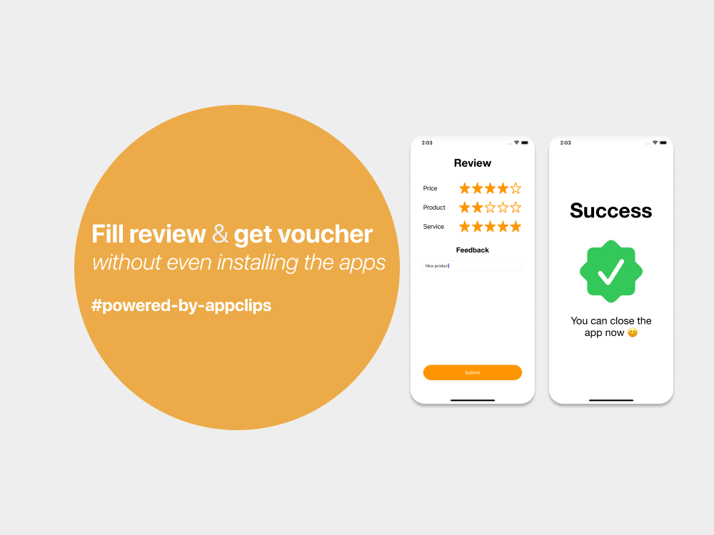

# Reviewistic Customer App

customer app for [reviewistic](https://github.com/davindj/reviewistic) app

## About
**Review in a simple, fast, and convenient way**  
Reviewistic use [Apps Clip experience](https://developer.apple.com/documentation/appstoreconnectapi/app_store/app_clips_and_app_clip_experiences) technology, so the customer can experience the apps without even need to install them in the app store, just by scan QRcode generated by the business owner.


## Installation
1. download / clone this project
2. open `reviewistic-customer/reviewistic-customer.xcodeproj` in [xcode](https://developer.apple.com/xcode/)
3. setup environment variables such as `AIRTABLE_URL`, `AIRTABLE_API_KEY`, and `_XCAppClipURL` at Edit Scheme > _Reviewistic Customer Clip Template_ > Run > Environment Variables.
4. build & run this project

## Notes
- if you can't run this project because lack of identifier, you should make your own identifier in [apple developer website](https://developer.apple.com) and setup build setting in xcode
- you can try to change parameter of transactionId in `_XCAppClipURL` `t` query string
- if you want the app to run without using xcode, you need to setup two things:
    - app clips local experience. here good resource to do that https://medium.com/@emcro/setting-up-and-testing-app-clips-in-ios-14-3d5ac193d1bc
    - hardcode `AIRTABLE_URL` and `AIRTABLE_API_KEY` in `reviewistic-customer/reviewistic-customerclip/TransactionModel.swift`
        ```swift
        ...
        static var AIRTABLE_URL: String {
            "https://api.airtable.com/v0/jassDK12DDsda" // <-- this one
        }
        static var AIRTABLE_API_KEY: String {
            "keys7A1poLWvQm10A" // <-- and this one
        }
        ...
        ```
